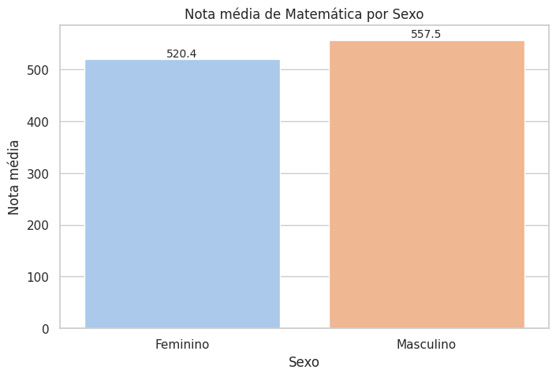
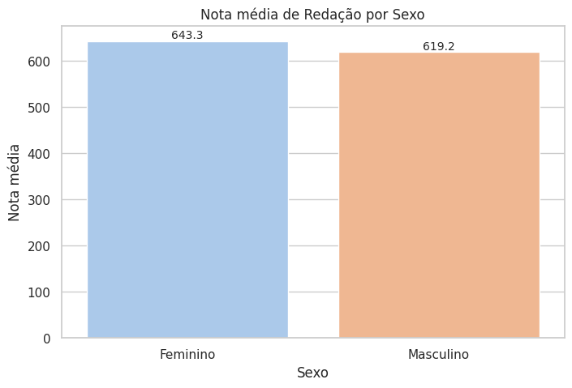
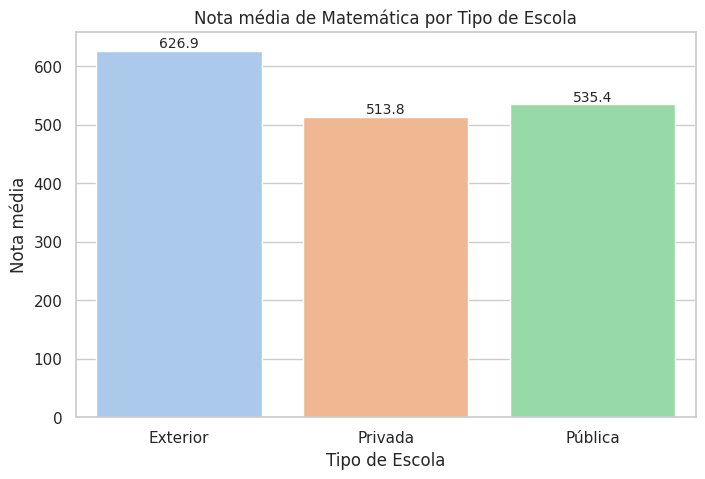
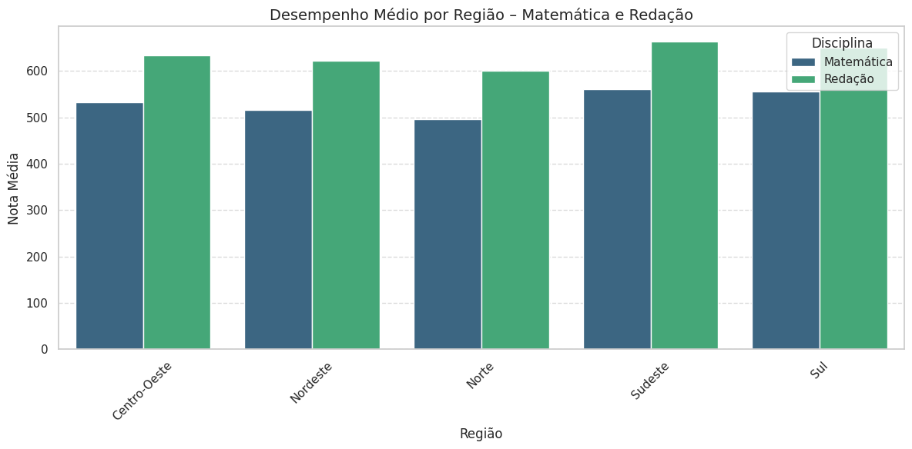

# Análise Exploratória das Notas do ENEM 2022

Este projeto realiza uma análise exploratória das notas do ENEM, focando em Matemática e Redação, segmentadas por sexo, renda, tipo de escola, região e estado.

## Dados

Dados públicos do ENEM extraídos de [INEP]((https://www.gov.br/inep/pt-br/acesso-a-informacao/dados-abertos/microdados/enem).

## Principais análises

- Comparação de médias por sexo
- Impacto da renda nas notas
- Diferenças entre tipos de escola (exterior, pública e privada)
- Desempenho por regiões e estados

## Visualizações
 
 
 
 

## Como executar

Abra o notebook no Google Colab para reproduzir as análises.
[Análise do ENEM no Google Colab](https://colab.research.google.com/drive/1UnIiCjWzY7GWDdRPbLTq9WyPn-G3R6Ec#scrollTo=qWDKrwDPoko3&uniqifier=2) 

## Conclusão

A análise dos dados do ENEM indicou variações significativas nas notas de matemática e redação por sexo, renda, tipo de escola e região. Alunos de escolas privadas, com maior renda e das regiões Sudeste e Sul apresentam desempenho superior. Essas diferenças evidenciam desigualdades educacionais que podem orientar políticas públicas para melhoria do ensino e redução das disparidades.

## 🙋‍♀️ **Sobre mim**
Elisângela Dias • Dados & Insights | [LinkedIn](https://www.linkedin.com/in/elisangeladias-dados/) • [Kaggle](https://www.kaggle.com/elisdias)
